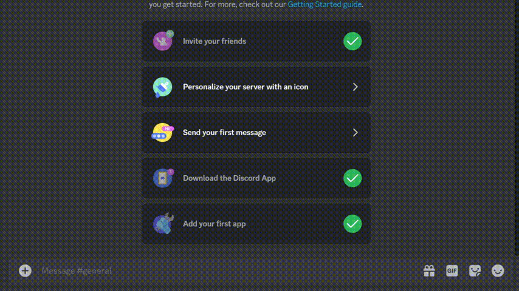

# RAG Discord Bot

This Discord bot utilizes the Retrieval-Augmented Generation (RAG) approach to enhance the output of a large language model by referencing an authoritative knowledge base outside of its training data sources. The bot is designed to interact with users through Discord slash commands, allowing them to query an underlying knowledge base for relevant information.



## Prerequisites

Before running the bot, make sure you have the following dependencies installed:

- Python 3.10 or higher

## Getting Started

1. Clone the repository to your local machine:

```bash
git clone https://github.com/nur-zaman/LLM-RAG-Bot.git
cd LLM-RAG-Bot
```

2. Create a virtual environment (optional but recommended):

```bash
python -m venv venv
```

3. Activate the virtual environment:

- On Windows:

```bash
venv\Scripts\activate
```

- On Unix or MacOS:

```bash
source venv/bin/activate
```

4. Install the required dependencies:

```bash
pip install -r requirements.txt
```

5. Rename the `.env.example` file to `.env` in the project root directory and add your tokens and api keys:

```env
DISCORD_BOT_TOKEN=your_bot_token_here
OPENAI_API_KEY=your_openai_api_key
```

## Running the Bot

Execute the `run.bat` file to start the bot:

```bash
run.bat
```

This will launch the bot, and you should see "Ready" in the console once it has successfully connected to Discord.

## Bot Usage

The bot responds to a single slash command:

### `/query`

- **Description:** Enter your query :)
- **Options:**
  - `input_text` (required): The input text for the query.

### `/updatedb`

- **Description:** Updates your information database

## Additional Notes

- [llamaIndex documentation](https://docs.llamaindex.ai/en/stable/).
- [refreshing-private-data-sources-with-llamaindex](https://betterprogramming.pub/refreshing-private-data-sources-with-llamaindex-document-management-1d1f1529f5eb).
